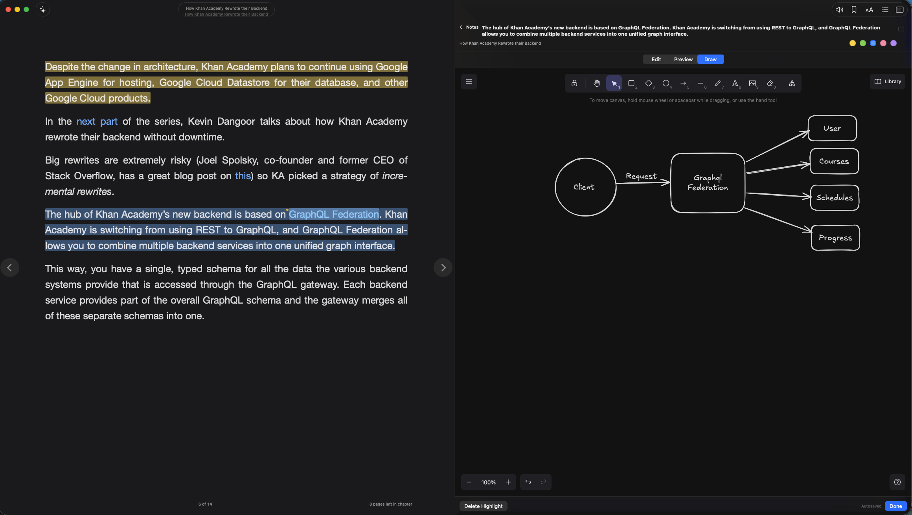
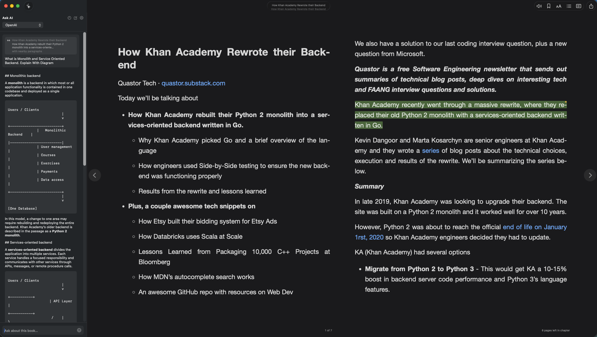
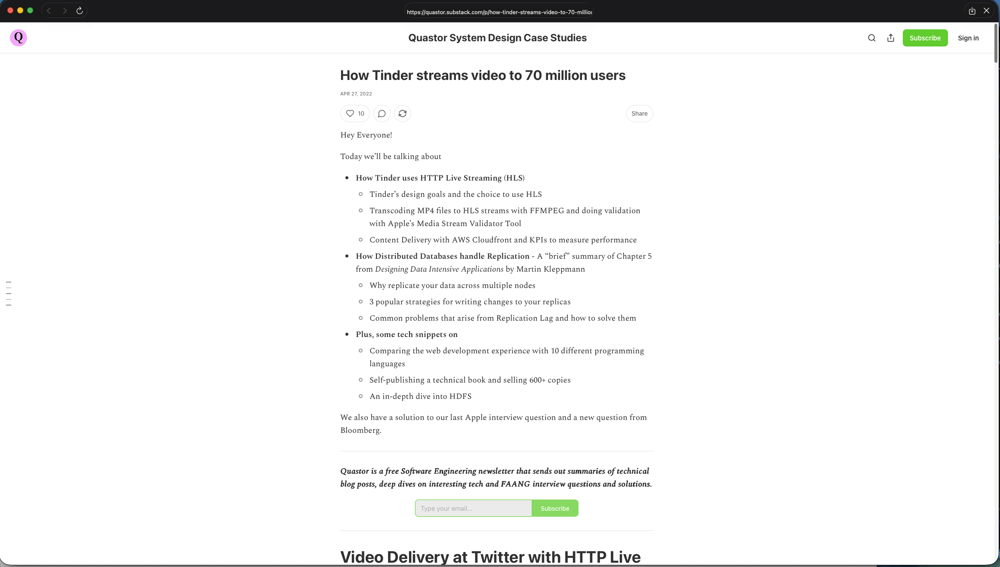
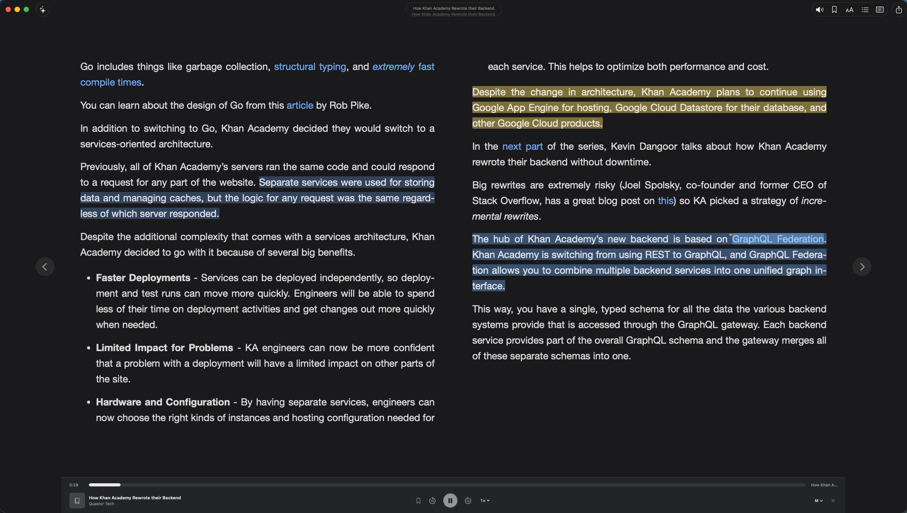

# Kodi Reader

[](LICENSE)

A lightweight native EPUB reader for macOS. Paginated reading, typography and
theme controls, highlights with notes and drawings, configurable Ask AI, webpage
reading, and fluent on-device read-aloud — without the store, the sync, or the
library management.

Kodi Reader is **not affiliated with** the [Kodi media center](https://kodi.tv/)
or the XBMC Foundation.

## Features

### Book reading
Paginated EPUB rendering with typography, margin, and theme controls, plus position and progress that survive layout changes.


### Notes taking
Text highlights in multiple colors, each with an attached note, stored alongside the book.


### Visual notes
Freeform sketches per highlight via a bundled, offline [Excalidraw](https://excalidraw.com/) editor.



### Ask AI
Opt-in, configurable OpenAI-compatible chat about the book, with per-book chat threads and surrounding-passage context sent for better answers.



### Open web apps and websites
Load an article or page, extract the readable content, and read it in the same paginated view as a book.



### Audio reading
On-device read-aloud using [Kokoro](https://github.com/hexgrad/kokoro), no cloud TTS.



## Status

Source is public under MIT. Issues are welcome for bugs. **Pull requests are
not the goal right now** — this is a source-available personal project, not a
contributor funnel. See [NOTICE.md](NOTICE.md) for third-party licenses and
[SECURITY.md](SECURITY.md) to report vulnerabilities privately.

A macOS disk image is published on [GitHub Releases](https://github.com/dev-olly/kodi-reader/releases/latest). The build is ad-hoc signed; first open may need Right-click → Open. You can also build from source (Xcode 26).

## Privacy

- Books, highlights, notes, and drawings stay on this Mac (sandbox Application
  Support). Nothing is extracted from the EPUB to a temp folder for reading.
- There is no analytics or telemetry.
- **Ask AI** is opt-in. You configure an OpenAI-compatible endpoint; quoted
  passages and chat go only there. API keys live in `ai-keys.json` inside the
  app's sandbox container (POSIX `0600`), not in the Keychain.
- Opened webpages are fetched and converted locally. There are no extra
  network calls beyond the page itself.
- **Read-aloud** downloads the Kokoro voice model into Application Support on
  first use (Apache-2.0 weights, a few hundred megabytes). Synthesis runs
  locally.

## Requirements

- macOS 15 or later, Apple Silicon (read-aloud uses Kokoro / MLX)
- Xcode 26 or later (KokoroSwift requires Swift 6.2)
- [XcodeGen](https://github.com/yonaskolb/XcodeGen) to generate the project file

```sh
brew install xcodegen
```

## Building

The app target needs Xcode 26 (KokoroSwift). `swift test` for EpubKit and
ReaderUI still runs on older toolchains. Signing is ad-hoc (`CODE_SIGN_IDENTITY:
"-"`) so the app runs locally; it is not a notarized distribution build.
First open of a downloaded build may need Right-click → Open.

```sh
xcodegen generate
open KodiReader.xcodeproj
```

Or from the command line:

```sh
xcodegen generate
xcodebuild -project KodiReader.xcodeproj -scheme KodiReader -configuration Debug build
```

The `.xcodeproj` is generated from `project.yml` and is not committed, so
regenerate it after pulling changes that touch the project layout.

The bundle identifier is `com.olly.KodiReader`. Product name lives in
`project.yml` as `PRODUCT_NAME: Kodi Reader`.

Push a `v*` tag to cut a GitHub Release. Actions builds `KodiReader.dmg`
and attaches it:

```sh
git tag v0.1.0
git push origin v0.1.0
```

Or package locally (Apple Silicon, Xcode 26):

```sh
./Scripts/package-dmg.sh 0.1.0
```

## Testing

```sh
./Scripts/fetch-samples.sh   # downloads three Project Gutenberg books
swift test
```

`EpubKitTests` covers container and metadata parsing against real books;
`ReaderUITests` drives a live `WKWebView` through the whole rendering path and
asserts that pagination, page turns, progress, and position restoring all work.
Tests skip rather than fail if the sample books have not been downloaded.

### Looking at pages

```sh
swift test --filter SnapshotTests
open Snapshots/
```

This renders real pages to PNGs in `Snapshots/` using `WKWebView.takeSnapshot`,
covering every theme, a two-column spread, the typography extremes, and
highlights on both light and dark backgrounds. It captures the web view's own
output in-process, so it needs no screen recording permission and shows what
the reader actually draws rather than whatever is on the display.

It is worth doing after any change to `reader.css`. Assertions cannot tell you
that a page is *ugly*, and a theme bug that made dark mode black-on-black
passed every functional test before the snapshots exposed it.

## How it works

```
EpubKit    parsing and persistence, no UI, portable to iOS
ReaderUI   the rendering engine: scheme handler, reader.js, reader.css
App        the SwiftUI macOS app
```

**Why a custom engine.** The obvious choice would be the
[Readium Swift toolkit](https://github.com/readium/swift-toolkit), but it is
UIKit-only and the maintainers have
[no short-term plans for macOS](https://github.com/readium/swift-toolkit/issues/783).
`WKWebView` has the same API on macOS and iOS, so building a thin engine on top
of it keeps the door open for an iOS port. The only third-party dependency is
ZIPFoundation.

**Serving the book.** A `WKURLSchemeHandler` answers `epubreader://` requests
straight from the ZIP. Nothing is extracted to disk, no local HTTP server is
involved, and the whole book shares one origin so relative links between
chapters resolve on their own. Spine documents get the reader stylesheet and
runtime injected into their `<head>` on the way through.

**Pagination.** The body is a CSS multi-column box one viewport tall. Content
overflows sideways into further columns and a page turn scrolls the document by
one viewport width. That stride only holds if the column gap is exactly twice
the horizontal margin, which is the invariant `reader.js` maintains when it
computes the layout — it is what lets one-column and two-column spreads share
the same paging code.

**Anchoring.** Reading positions and highlight endpoints are stored as a chain
of `childNode` indices from `<body>` plus a character offset, which is a
simplified EPUB CFI. Because the book's markup never changes, the anchor stays
valid across font size, margin, theme, and window size changes, none of which a
scroll offset would survive. Pages with no text at all, like a cover, fall back
to anchoring on an element.

**Highlights** are painted as absolutely positioned rects over the text, blended
with `multiply` on light themes and `screen` on dark ones so the glyphs stay
readable. Drawing them on top rather than behind is what lets a click land on a
highlight and open its note.

**Storage** is a single JSON file in Application Support holding reading
positions, annotations, bookmarks, and settings. Opened books are copied into
the app’s sandbox library so Recents can reopen them without asking again.
Excalidraw scenes live as sidecar files next to that JSON
(`Drawings/<bookID>/<annotationID>.excalidraw.json`) so the library stays small.

## Rebuilding the Excalidraw host

The drawing editor is a bundled, offline Excalidraw build. npm is only needed
when changing that host:

```sh
cd Tools/excalidraw-host
npm ci
npm run build
```

That writes static assets into `Sources/ReaderUI/Resources/Excalidraw/`. Commit
those generated files so the app builds without Node.

## Not included

No library shelf, DRM/LCP, sync, OPDS catalogues, bundled audiobooks, or
fixed-layout EPUB. Books are opened with `Cmd-O` or by dropping them on the
window; articles and websites can be opened from a URL. The welcome screen
lists what you were reading recently.

Read-aloud uses [Kokoro](https://github.com/hexgrad/kokoro) locally via
[KokoroSwift](https://github.com/mlalma/kokoro-ios). The first listen downloads
the voice model (a few hundred megabytes) into Application Support.
