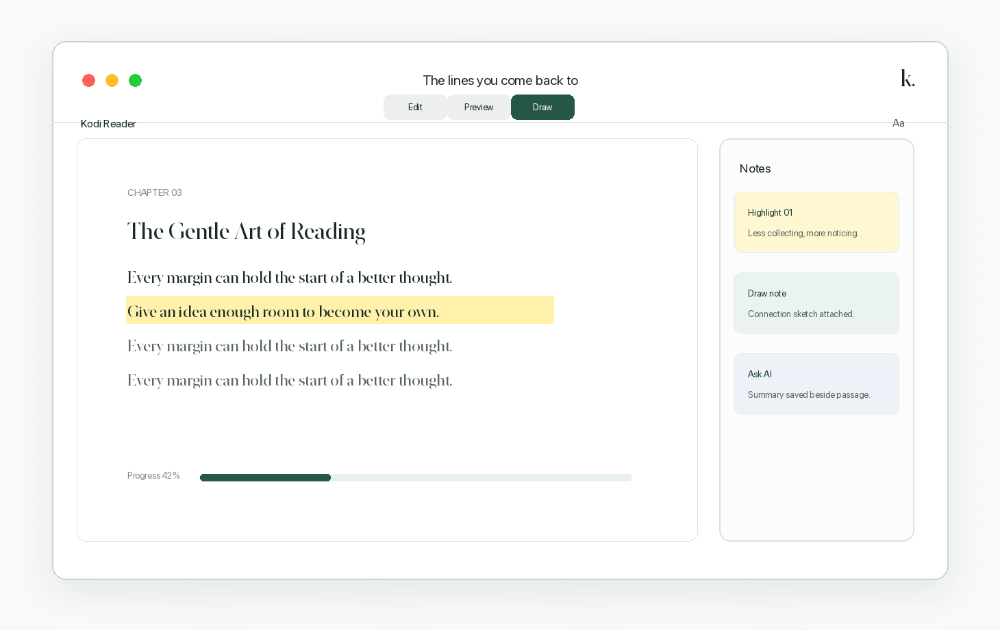
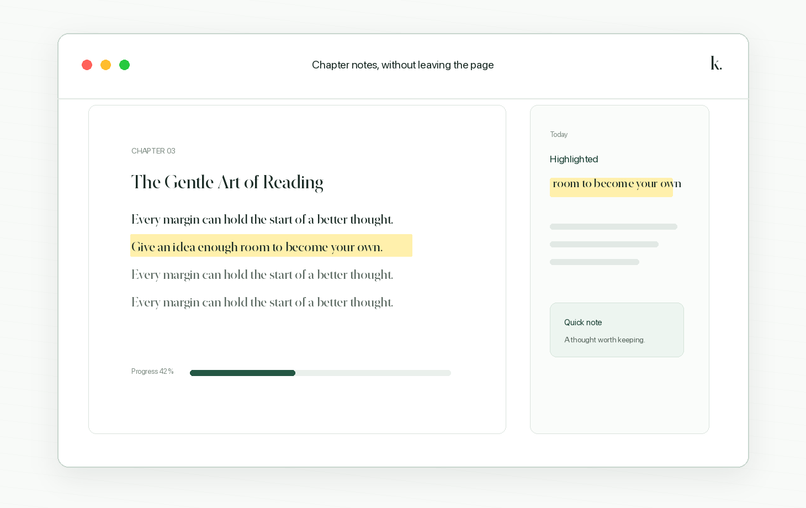
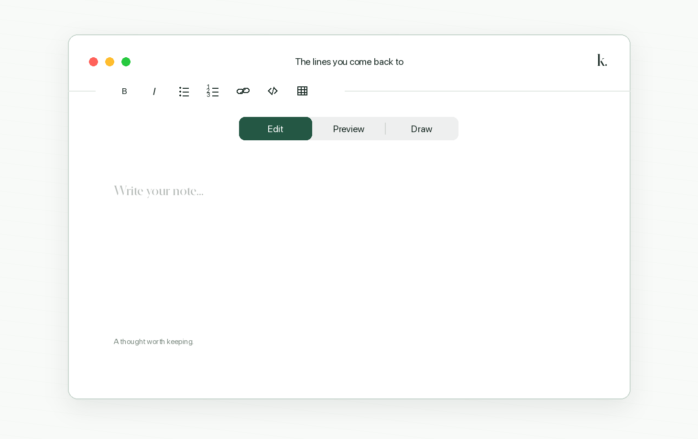
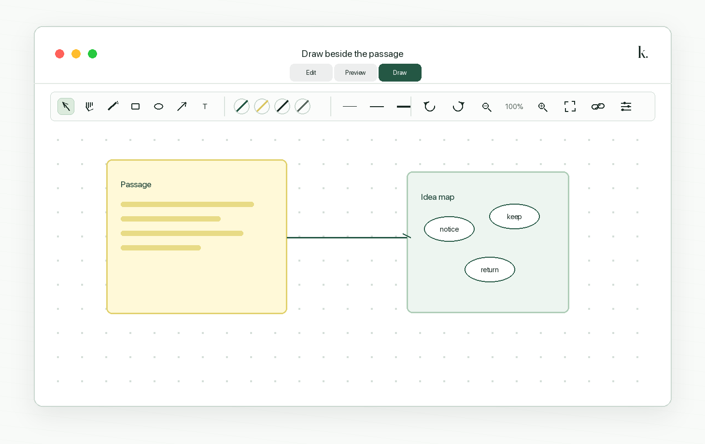
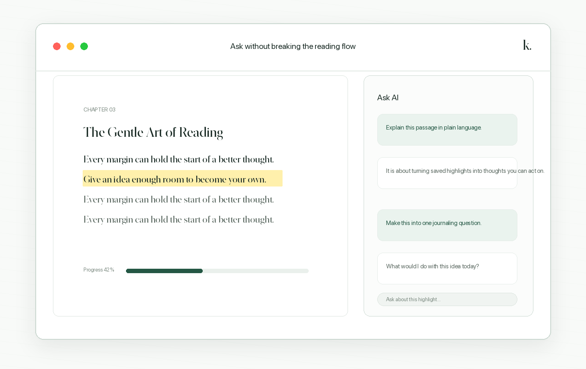
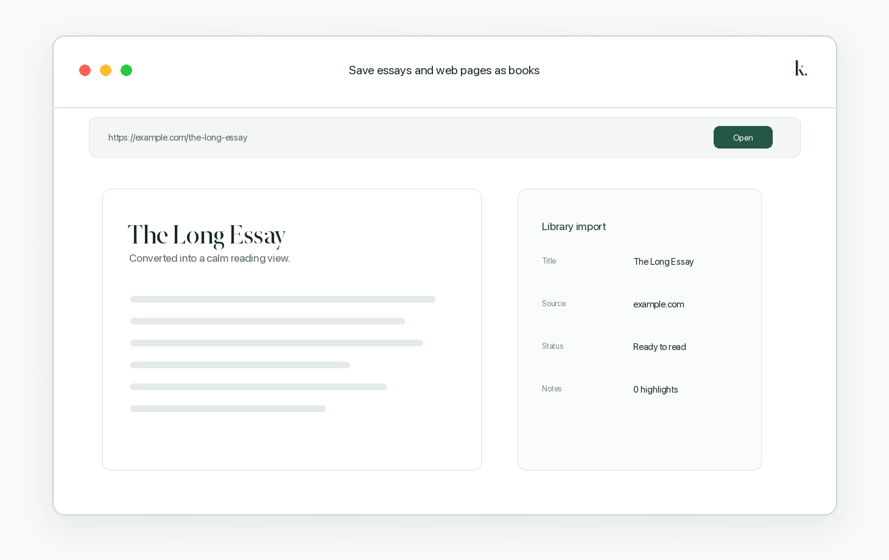

# Kodi Reader

[](LICENSE)

A lightweight native EPUB and PDF reader for macOS. Paginated reading, typography and
theme controls, highlights with notes and drawings, configurable Ask AI, webpage
reading, and a distraction-free interface — without the store, the sync, or
the library management.



Kodi Reader is **not affiliated with** the [Kodi media center](https://kodi.tv/)
or the XBMC Foundation.

## Features

### Book and document reading
Paginated EPUB rendering with typography, margin, and theme controls, plus native PDF reading with fit-to-page zoom and adaptive two-page spreads. Position and progress survive layout changes and app relaunches.



### Notes taking
Text highlights in multiple colors, each with an attached note, stored alongside the book.



### Visual notes
Freeform sketches per highlight via a bundled, offline [Excalidraw](https://excalidraw.com/) editor.



### Ask AI
Opt-in OpenAI-powered chat about the book, with per-book chat threads and surrounding-passage context sent for better answers.



### Open web apps and websites
Load an article or page, extract the readable content, and read it in the same paginated view as a book.



## Status

Source is public under MIT. Issues are welcome for bugs. **Pull requests are
not the goal right now** — this is a source-available personal project, not a
contributor funnel. See [NOTICE.md](NOTICE.md) for third-party licenses and
[SECURITY.md](SECURITY.md) to report vulnerabilities privately.

A macOS disk image is published on [GitHub Releases](https://github.com/dev-olly/kodi-reader/releases/latest). Release builds are signed with Developer ID and notarized by Apple. You can also build from source (Xcode 16.3 or later).

The site is deployed on Vercel at [www.kodi-reader.app](https://www.kodi-reader.app/).

## Privacy

- Books, PDFs, highlights, notes, and drawings stay on this Mac (sandbox
  Application Support). EPUBs are read directly from their archives and PDFs
  remain byte-for-byte unchanged; Kodi annotations are stored separately.
- There is no analytics or telemetry.
- **Ask AI** is opt-in. Quoted passages and chat are sent to the hosted Kodi AI
  proxy, which forwards requests to OpenAI. The OpenAI API key lives only on the
  server, never in the Mac app. Kodi AI uses a stronger default model tuned for
  simple explanations with references to the passages you attach.
- Ask AI requires email-code sign-in through Supabase. Supabase stores the account
  email and authentication records; the configured email provider delivers login codes.
  Session tokens stay in macOS Keychain. The AI proxy validates the session and applies
  temporary per-account/IP request limits; it does not log tokens or book passages.
  Sign out or delete the account from the Ask AI account menu. Local books, notes, and
  conversations remain on this Mac after either action.
- Opened webpages are fetched and converted locally. There are no extra
  network calls beyond the page itself.

## Requirements

- macOS 15 or later
- Xcode 16.3 or later (Swift 6.1 is required by the authentication SDK)
- [XcodeGen](https://github.com/yonaskolb/XcodeGen) to generate the project file
- Node.js/npm only when changing the bundled Excalidraw drawing host

```sh
brew install xcodegen
```

## Setup

For hosted Ask AI, follow [the email authentication setup guide](docs/ask-ai-auth-setup.md).
Without Supabase configuration the reader works normally, but AI sign-in is unavailable.

### Install the app

Download `KodiReader.dmg` from
[GitHub Releases](https://github.com/dev-olly/kodi-reader/releases/latest),
open it, and drag `Kodi Reader.app` into Applications.

Current releases are signed with Developer ID and notarized by Apple. macOS
will still show its normal confirmation the first time an Internet-downloaded
app is opened.

### Build from source

Clone the repository and install XcodeGen:

```sh
git clone https://github.com/dev-olly/kodi-reader.git
cd kodi-reader
brew install xcodegen
```

Debug builds use ad-hoc signing so they run locally without distribution
credentials. Release builds require the project's Developer ID certificate.
On a machine with multiple Xcode versions, point the shell at the Xcode you want:

```sh
export DEVELOPER_DIR=/Applications/Xcode.app/Contents/Developer
```

Generate the Xcode project and open it:

```sh
xcodegen generate
open KodiReader.xcodeproj
```

Or build from the command line. Debug builds on this machine should disable
code signing:

```sh
xcodegen generate
xcodebuild \
  -project KodiReader.xcodeproj \
  -scheme KodiReader \
  -configuration Debug \
  -destination 'platform=macOS' \
  CODE_SIGNING_ALLOWED=NO \
  build
```

The `.xcodeproj` is generated from `project.yml` and is not committed, so
regenerate it after pulling changes that touch the project layout.

The bundle identifier is `com.olly.KodiReader`. Product name lives in
`project.yml` as `PRODUCT_NAME: Kodi Reader`.

### Brand assets

The shared logo master is [`website/assets/kodi-logo.svg`](website/assets/kodi-logo.svg).
It uses solid forest green (`#245744`) and a white k with an upward-turning page.
To regenerate the macOS app icon, welcome-screen image, website PNGs, and favicons
after editing the master, run on macOS:

```sh
swift Scripts/generate-brand-assets.swift
```

Generated assets are committed, so normal builds do not need this step.

### Package a DMG

The release script expects this signing identity, including its private key, in
the login keychain:

```text
Developer ID Application: Emmanuel Onyebueke (3FJF74RW5L)
```

Before the first notarized release, save notarization credentials in the login
keychain. Use an app-specific password rather than an Apple Account password:

```sh
xcrun notarytool store-credentials "KodiReaderNotary" \
  --apple-id "YOUR_APPLE_ACCOUNT_EMAIL" \
  --team-id "3FJF74RW5L" \
  --password "YOUR_APP_SPECIFIC_PASSWORD"
```

Create a publishable release with:

```sh
./Scripts/package-dmg.sh 0.2.0 --notarize
```

The script regenerates the Xcode project, builds a Developer ID-signed Release
app for Apple Silicon, checks its embedded frameworks and Hardened Runtime,
creates and signs `KodiReader.dmg`, submits it to Apple's notary service, staples
the ticket, and verifies Gatekeeper acceptance. Running without `--notarize`
creates a signed diagnostic DMG but prints a warning because it is not safe to
publish. `KODI_SIGNING_IDENTITY`, `KODI_TEAM_ID`, and `KODI_NOTARY_PROFILE` can
override the release defaults.

## Testing

```sh
./Scripts/fetch-samples.sh   # downloads three Project Gutenberg books
swift test
```

`EpubKitTests` covers container and metadata parsing against real books;
`ReaderUITests` drives a live `WKWebView` through the whole rendering path and
asserts that pagination, page turns, progress, and position restoring all work.
Tests skip rather than fail if the sample books have not been downloaded.

### Looking at pages

```sh
swift test --filter SnapshotTests
open Snapshots/
```

This renders real pages to PNGs in `Snapshots/` using `WKWebView.takeSnapshot`,
covering every theme, a two-column spread, the typography extremes, and
highlights on both light and dark backgrounds. It captures the web view's own
output in-process, so it needs no screen recording permission and shows what
the reader actually draws rather than whatever is on the display.

It is worth doing after any change to `reader.css`. Assertions cannot tell you
that a page is *ugly*, and a theme bug that made dark mode black-on-black
passed every functional test before the snapshots exposed it.

## How it works

```
EpubKit    EPUB/PDF models, parsing, and persistence, no app UI
ReaderUI   the EPUB web renderer and native PDFKit reading surface
App        the SwiftUI macOS app
```

**Why a custom engine.** The obvious choice would be the
[Readium Swift toolkit](https://github.com/readium/swift-toolkit), but it is
UIKit-only and the maintainers have
[no short-term plans for macOS](https://github.com/readium/swift-toolkit/issues/783).
`WKWebView` has the same API on macOS and iOS, so building a thin engine on top
of it keeps the door open for an iOS port. The only third-party dependency is
ZIPFoundation.

**Serving the book.** A `WKURLSchemeHandler` answers `epubreader://` requests
straight from the ZIP. Nothing is extracted to disk, no local HTTP server is
involved, and the whole book shares one origin so relative links between
chapters resolve on their own. Spine documents get the reader stylesheet and
runtime injected into their `<head>` on the way through.

**Pagination.** The body is a CSS multi-column box one viewport tall. Content
overflows sideways into further columns and a page turn scrolls the document by
one viewport width. That stride only holds if the column gap is exactly twice
the horizontal margin, which is the invariant `reader.js` maintains when it
computes the layout — it is what lets one-column and two-column spreads share
the same paging code.

**Anchoring.** Reading positions and highlight endpoints are stored as a chain
of `childNode` indices from `<body>` plus a character offset, which is a
simplified EPUB CFI. Because the book's markup never changes, the anchor stays
valid across font size, margin, theme, and window size changes, none of which a
scroll offset would survive. Pages with no text at all, like a cover, fall back
to anchoring on an element.

**Highlights** are painted as absolutely positioned rects over the text, blended
with `multiply` on light themes and `screen` on dark ones so the glyphs stay
readable. Drawing them on top rather than behind is what lets a click land on a
highlight and open its note.

**PDFs** use Apple's PDFKit in a native paged view. Kodi stores page-local text
ranges for highlights and rebuilds transient PDF annotations when a document
opens, so neither the original PDF nor the imported library copy is modified.
Scanned pages remain viewable but need embedded text for selection and Ask AI.

**Storage** is a single JSON file in Application Support holding reading
positions, annotations, bookmarks, and settings. Opened books are copied into
the app’s sandbox library so Recents can reopen them without asking again.
Excalidraw scenes live as sidecar files next to that JSON
(`Drawings/<bookID>/<annotationID>.excalidraw.json`) so the library stays small.

## Rebuilding the Excalidraw host

The drawing editor is a bundled, offline Excalidraw build. npm is only needed
when changing that host:

```sh
cd Tools/excalidraw-host
npm ci
npm run build
```

That writes static assets into `Sources/ReaderUI/Resources/Excalidraw/`. Commit
those generated files so the app builds without Node.

## Not included

No library shelf, DRM/LCP, OCR, password-protected PDF support, sync, OPDS
catalogues, bundled audiobooks, or fixed-layout EPUB. EPUBs and PDFs are opened
with `Cmd-O` or by dropping them on the window; articles and websites can be
opened from a URL. The welcome screen lists what you were reading recently.
